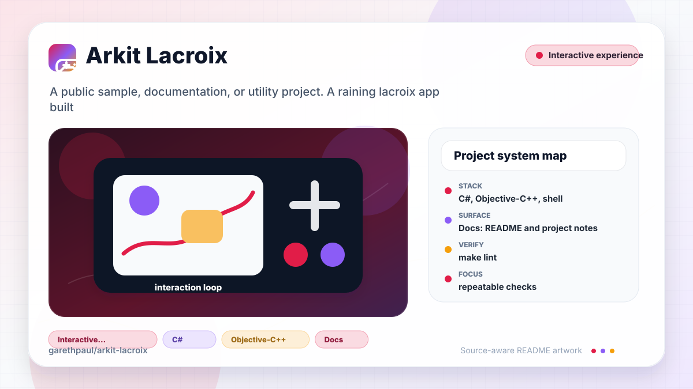

# arkit-lacroix

<!-- README-OVERVIEW-IMAGE -->


## Overview

`garethpaul/arkit-lacroix` is a public sample, documentation, or utility project. A raining lacroix app built using Unity and ARKit

This README is based on the checked-in source, manifests, scripts, and repository metadata on the `master` branch. The project language mix found during review was: C# (55), Objective-C++ (1), shell (1).

## Repository Contents

- `README.md` - project overview and local usage notes
- `.github/workflows/check.yml` - GitHub Actions baseline for `make check`
- `Assets` - source or example code
- `docs` - source or example code
- `ProjectSettings` - source or example code
- `scripts` - source or example code
- `SECURITY.md` - security reporting and disclosure guidance
- `VISION.md` - project direction and maintenance guardrails

Additional scan context:

- Source directories: Assets, ProjectSettings, docs, scripts
- Dependency and build manifests: none detected
- Entry points or build surfaces: none detected
- Test-looking files: Assets/HSVPicker/Other/ColorPickerTester.cs, Assets/Plugins/iOS/UnityARKit/NativeInterface/ARHitTestResult.cs, Assets/Plugins/iOS/UnityARKit/NativeInterface/ARHitTestResultType.cs, Assets/Plugins/iOS/UnityARKit/NativeInterface/ARLightEstimate.cs, Assets/Plugins/iOS/UnityARKit/UnityARHitTestExample.cs

## Getting Started

### Prerequisites

- Git

### Setup

```bash
git clone https://github.com/garethpaul/arkit-lacroix.git
cd arkit-lacroix
```

The setup commands above are derived from repository files. Legacy mobile, Python, or JavaScript samples may require older SDKs or package versions than a modern workstation uses by default.

## Running or Using the Project

- No single runtime entry point was identified. Start by reading the source files and manifests listed above.

## Testing and Verification

Run the SDK-free source baseline and root wrapper gates first:

```sh
make lint
make test
make build
make check
scripts/check-baseline.sh
```

Unity editor version: 5.6.1p1. This host does not have Unity installed, so full editor, iOS export, and ARKit device verification must happen on a machine with the matching legacy Unity/iOS toolchain. The root `make build` target keeps the SDK-free preflight repeatable and reports the Unity requirement because no batch build method is checked in.

GitHub Actions runs `make check` on pushes, pull requests, and manual
dispatches. The workflow uses a commit-pinned checkout action, read-only
repository access, and a bounded runtime. On hosted Linux runners without
Unity, the SDK-free source baseline still runs and the Unity build step reports
the required legacy editor.
GitHub CodeQL default setup analyzes GitHub Actions and Unity C# without the
legacy editor. It is intentionally not duplicated by an advanced workflow;
the Objective-C++ bridge remains outside the successful default-setup result
and requires a separately validated native-analysis path.

The source baseline checks the active `Assets/GameScene.unity` build scene, stable scene/prefab GUIDs, generated Unity directory ignore policy, keeps the original 1000-can cleanup cap explicit, repairs invalid spawn caps, bounds spawn caps to the original 1000-can limit, keeps runtime cap repair in the shared spawn path, prunes missing spawned-can references before cap enforcement, evicts the oldest tracked can only after the live count exceeds the cap, avoids duplicate Rigidbody components on spawned cans, cleans up tracked cans when the spawner is disabled, guards AR ambient light updates when scene components or AR sessions are unavailable, and ensures `ParticlePainter` unsubscribes from AR frame and color-picker events when inactive while bounding paint samples to the configured movement window.

When the required SDK or runtime is unavailable, use static checks and source review first, then verify on a machine that has the matching platform toolchain.

## Configuration and Secrets

- No required secret or credential file was identified in the repository scan. If you add integrations later, keep secrets out of git.

## Security and Privacy Notes

- Review changes touching authentication or token handling; examples from the scan include Assets/Plugins/iOS/UnityARKit/NativeInterface/ARErrorCode.cs, Assets/Plugins/iOS/UnityARKit/NativeInterface/ARSessionNative.mm, Assets/Plugins/iOS/UnityARKit/NativeInterface/UnityARSessionNativeInterface.cs, Assets/Plugins/iOS/UnityARKit/UnityARKitControl.cs, and 1 more.
- Review changes touching network requests, sockets, or service endpoints; examples from the scan include Assets/Plugins/iOS/UnityARKit/Utility/UnityARMatrixOps.cs, Assets/TUTORIAL.txt.
- Review changes touching file, media, JSON, XML, CSV, OCR, or data parsing; examples from the scan include Assets/HSVPicker/UI/ColorImage.cs, Assets/HSVPicker/UI/ColorPresets.cs, Assets/HSVPicker/UI/ColorSliderImage.cs, Assets/HSVPicker/UI/HexColorField.cs, and 3 more.
- Review changes touching database, model, or persistence code; examples from the scan include docs/plans/2026-06-08-unity-arkit-scene-baseline.md, docs/plans/2026-06-08-unity-sodaspawn-safety-baseline.md.

## Maintenance Notes

- `SodaSpawn.maxSodas` is bounded to the original 1000-can cleanup cap through
  the Unity inspector range and runtime repair helper.
- `SodaSpawn` prunes missing spawned-can references before enforcing the cap so
  the tracked list reflects live spawned objects.
- `SodaSpawn` evicts the oldest tracked can after a spawn exceeds `maxSodas`,
  avoiding periodic full-scene cleanup while retaining the configured limit.
- `SodaSpawn` uses a repaired 0.1-second default cadence, bounded to 0.05-5
  seconds, so can creation and steady-state eviction are not tied to frame rate.
- `UnityARAmbient` skips ARKit intensity writes when its scene `Light` or AR
  session is unavailable.
- `UnityARAmbient` refreshes missing AR ambient light dependencies before each
  device update.
- `UnityARAmbient` rejects non-finite or negative AR ambient intensity values
  before writing to the scene `Light`.
- `UnityARAmbient` rejects AR ambient intensity values above Unity's
  over-bright range before writing to the scene `Light`.
- `ParticlePainter` validates required scene references before initialization,
  tolerates a missing main camera, and releases global AR frame and color-picker
  listeners when disabled or destroyed.
- `ParticlePainter` repairs invalid distance thresholds, anchors the first valid
  AR frame without painting, and advances past tracking jumps above the maximum
  distance without adding a paint vertex.
- `ParticlePainter` bounds each paint stroke to 10,000 retained samples and
  reuses one particle buffer per active stroke instead of allocating a full
  replacement buffer after every accepted AR frame.
- ParticlePainter caps active and completed paint systems and releases owned systems on destruction.
- The UnityARBallz BallMaker caps retained balls, prunes missing objects, evicts
  oldest ownership first, and releases retained balls when disabled.
- UnityARBallz BallMover releases its tracked object before replacement and when disabled.
- Root `make lint`, `make test`, `make build`, and `make check` all preserve
  the SDK-free baseline before Unity-specific manual verification, including
  when invoked outside the repository root with `make -f`.
- See `SECURITY.md` for vulnerability reporting and safe research guidance.
- See `docs/plans/2026-06-09-unity-make-gate-targets.md` for the root gate
  target baseline.
- See `docs/plans/2026-06-09-unity-ambient-light-null-guard.md` for the AR
  ambient light null guard.
- See `docs/plans/2026-06-09-unity-ambient-light-dependency-refresh.md` for the
  AR ambient light dependency refresh guard.
- See `docs/plans/2026-06-09-unity-ambient-intensity-value-guard.md` for the AR
  ambient intensity value guard.
- See `docs/plans/2026-06-09-unity-ambient-intensity-upper-bound.md` for the AR
  ambient intensity upper-bound guard.
- See `docs/plans/2026-06-10-ci-baseline.md` for the lightweight GitHub
  Actions baseline.
- See `docs/plans/2026-06-10-unity-particle-painter-lifecycle.md` for the
  particle painter dependency and event-lifecycle guard.
- See `docs/plans/2026-06-13-unity-particle-painter-buffer.md` for the bounded
  stroke sample and reusable particle-buffer contract.
- See `docs/plans/2026-06-13-unity-sodaspawn-cadence.md` for the bounded,
  non-catch-up can spawn cadence.
- See `VISION.md` for project direction and contribution guardrails.
- See `CHANGES.md` for the maintenance history.

## Contributing

Keep changes small and tied to the project that is already present in this repository. For code changes, document the toolchain used, avoid committing generated dependency directories or local configuration, and update this README when setup or verification steps change.
